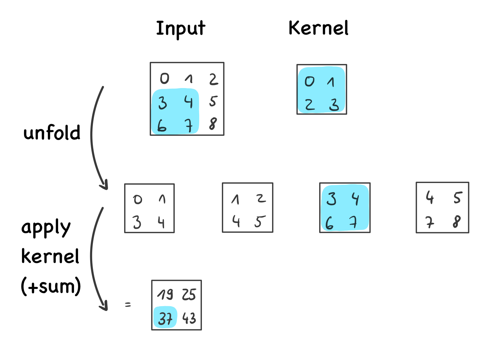
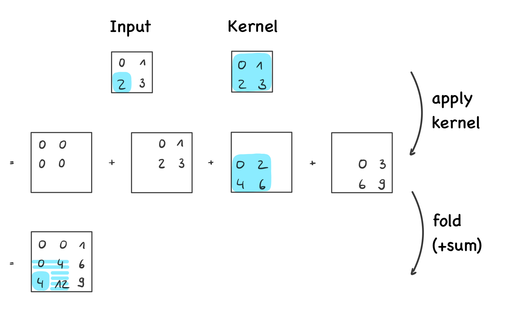

# PyTorch 2D Convolutional and Transposed Convolutional Layers Reimplementation

In this repository, you'll find a custom-built reimplementation of the 2D convolutional and transposed convolutional 
layers in PyTorch using the `torch.nn.functional.fold` and `torch.nn.functional.unfold` functions. 

By implementing these layers step-by-step, we can better understand their inner workings and modify them 
more easily. 
For instance, with this reimplementation, it is possible to implement variations where kernels with different weights 
are applied to each spatial location.

For ease of use, the custom layers have the same interface as the PyTorch layers.


## Custom Conv2d Layer

The custom `Conv2d` class in this repository is a reimplementation of the PyTorch's built-in 
2D Convolutional layer (`torch.nn.Conv2d`). 

### Usage

```python
import torch
from src import Conv2d

# Initialize convolutional layer using custom implementation.
reimplemented_conv = Conv2d.Conv2d(
    in_channels=in_channels,
    out_channels=out_channels,
    kernel_size=kernel_size,
    stride=stride,
    padding=padding,
    dilation=dilation,
)

# Apply layer to input tensor.
input_tensor = torch.rand(batch_size, in_channels, height, width)
output_tensor = reimplemented_conv(input_tensor)
```


### Custom Conv2d Layer Behavior

The custom 2D convolution layer implements the following steps:

1. Apply the PyTorch function `torch.nn.functional.unfold` to generate local blocks by patchifying the input tensor based on the hyperparameters.

2. Multiply each element of the kernel with its corresponding element in each patch and sum up the results. The summed result for each spatial location constitutes the output feature map.

3. Add a bias, if provided, to the obtained result to produce the final output.


For example, in the illustration below, the unfold operation extracts local blocks of size 2x2 (kernel_size=2) 
shifted by one (stride=1), without padding (padding=0) and without spacing between elements (dilation=1). 
Then, each element of the kernel (0,1,2,3) is applied to each element of the current spatial block 
(highlighted in blue; 3,4,6,7) and the products are summed to calculate the output value at the 
current location: 0x3 + 1x4 + 2x6 + 3x7 = 37.




## Custom ConvTranspose2d Layer

The `ConvTranspose2d` class is a reimplemented version of the PyTorch's built-in 2D transposed convolutional layer (`torch.nn.ConvTranspose2d`).


### Usage

```python
import torch
from src import ConvTranspose2d

# Initialize transposed convolutional layer using custom implementation.
reimplemented_conv_tran = ConvTranspose2d.ConvTranspose2d(
    in_channels=in_channels,
    out_channels=out_channels,
    kernel_size=kernel_size,
    stride=stride,
    padding=padding,
    output_padding=output_padding,
    dilation=dilation,
)

# Apply layer to input tensor.
input_tensor = torch.rand(batch_size, in_channels, height, width)
output_tensor = reimplemented_conv_tran(input_tensor)
```


### Custom ConvTranspose2d Layer Behavior

The custom 2D transposed convolution layer operates in the reverse order of the Conv2d layer:

1. Each element of the input tensor is multiplied by all elements of the kernel, creating a spatial output per input value.

2. The `torch.nn.functional.fold` function is applied to the results of the previous operation, summing up overlapping values to create the output tensor while considering the layer's hyperparameters.

3. If provided, a bias is added to this result to produce the final output.

For example, highlighted in blue in the illustration below, we first apply each value of the kernel (0,1,2,3) 
to the current input value (2), to get four output values (0x2=0, 1x2=2 2x2=4, 3x2=6). Thus, the outputs of this 
operation are of size 2x2 (kernel_size=2) for each input value. Then, these results are rearranged and recombined by 
spatially overlapping them by one row/column (stride=1), applying no padding or output_padding (padding=0, 
output_padding=0), and introducing no spacing between elements (dilation=1). The center value in the output, for example,
is the result of summing the values of the four overlapping outputs of the previous operation: 0 + 2 + 2 + 0 = 4.




## Dependencies

The project requires Python along with the following libraries: PyTorch, einops, and pytest.


## Testing

This repository includes tests which ensure that the reimplemented layers achieve the same results 
as the original PyTorch layers during the forward and backward passes.

To run these tests, use the following command:

```bash
pytest tests/
```


